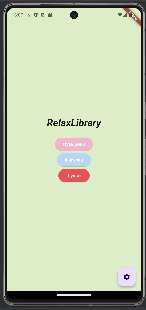
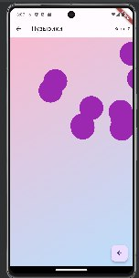
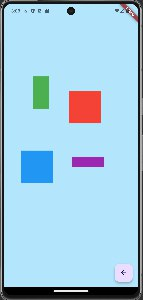
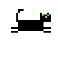
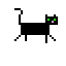

Данное приложение направлено на то что бы помочь людям расслабиться и просто посидеть в телефоне после долгой работы. Иногда когда не интересно сидеть в соцсетях или просто нет интернета, данное приложение может помочь «убить» время, немного расслабиться.

В наше время люди очень часто находятся в состоянии стресса. Будь то учёба или работа, человеку приходится быть в напряжении. И это напряжение хочется сбавить. Увы не у всех есть возможность сделать это путём прогулок, похода в спортзал или некоторыми другими способами.

Данное приложение поможет таким людям немного снять напряжение и стресс.

OC: Android 5.0 + \
Требуема память: 85 Мб

Для установки приложение нужно всего лишь скачать apk файл, размещённый в репозитории.

Приложение выполнено в пастельных тоннах. Сделано это в первую очередь для того что бы человек заходя в приложение в первую очередь не акцентировал внимание на ярких цветах.

 
В приложении есть три кнопки с переходом в игры и одна кнопка с переходом в настройки, где можно настроить звук приложения и есть ссылка на страницу разработчика в соцсетях.

Данное приложение выполнено с помощью Android Studio и плагина Flutter. Оно так же написано
полностью на языке Dart.

Было всего написано 4 страницы кода.

В ходе работы было реализовано главное окно с 4 кнопками, окно с игрой в пузырьки где на экране появляется рандомно количество пузырьков и пользователь должен нажимать на них что бы лопать. Сверху есть счёт лопнутых пузырьков.

Вторая игра представляет собой на данный момент 4 прямоугольника, которые можно свободно перемещать по экрану. 

Данная игра будет дорабатываться и в будущем будет добавлена физика предметов.

Третья игра не реализована. Но данная игра задумана как раннер с котом, схожий с гугл динозавриком. 

Чёрный кот с зелёными глазами по имени Шушик будет бежать по городу перепрыгивая через препятствия в виде мусорок и коробок. 

К данной игре уже было нарисованы
спрайты с бегом кота, прыжком и столкновением с препятствием. 

Данные спрайты есть как покадрово, так и в виде gif файлов и в будущем, после отрисовки всех спрайтов, будут
использованы в создании третьей игры.

  

 (1).gif>)

<h5>Некоторые спрайты отрисованые для третьей игры</h5>

Приложение было успешно реализовано и запущено на мобильном устройстве как эмулятор.

Позже была получен APK файл и приложение уже отдельно находилось на телефоне. 

Были достигнуты все поставленные цели, реализованы окна приложения, написан код и приложение полноценно соответствует своим задачам.

Мы проделали большую работу практически с нуля изучив язык программирования Dart. 

Так же достигли своих целей и воплотили в реальность свои идеи относительно приложения.

Надеюсь вам понравится!

